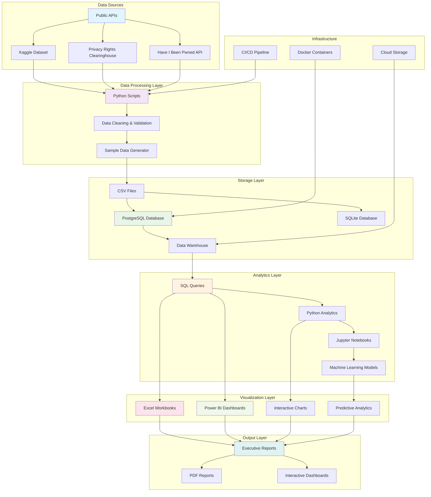
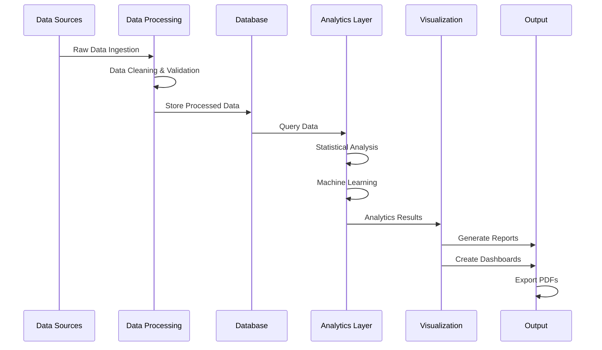

# Data Breach Insights Report - System Architecture

## 🏗️ Architecture Overview

This document describes the system architecture for the Data Breach Insights Report project, including data flow, components, and technology stack.

## 📊 System Architecture Diagram



## 🔄 Data Flow Architecture



## 🏛️ Component Architecture

### 1. Data Ingestion Layer
- **Python Scripts**: Automated data collection and processing
- **APIs**: Real-time data from external sources
- **File Processing**: CSV, JSON, and other data formats
- **Data Validation**: Quality checks and error handling

### 2. Data Storage Layer
- **PostgreSQL**: Primary relational database
- **SQLite**: Local development and testing
- **CSV Files**: Data exchange and backup
- **Data Warehouse**: Historical data storage

### 3. Analytics Engine
- **SQL Engine**: Complex queries and aggregations
- **Python Analytics**: Statistical analysis and ML
- **Jupyter Notebooks**: Interactive analysis
- **Machine Learning**: Predictive models

### 4. Visualization Platform
- **Excel Workbooks**: Pivot tables and charts
- **Power BI**: Interactive dashboards
- **Plotly**: Web-based visualizations
- **Matplotlib/Seaborn**: Static charts

### 5. Output Generation
- **Report Templates**: Standardized formats
- **PDF Export**: Executive summaries
- **Interactive Dashboards**: Real-time analytics
- **API Endpoints**: Data access

## 🛠️ Technology Stack

### Backend Technologies
- **Python 3.8+**: Core programming language
- **Pandas**: Data manipulation and analysis
- **NumPy**: Numerical computing
- **Scikit-learn**: Machine learning
- **SQLAlchemy**: Database ORM
- **Psycopg2**: PostgreSQL connector

### Database Technologies
- **PostgreSQL 15**: Primary database
- **SQLite 3**: Local development
- **Redis**: Caching layer (optional)

### Visualization Technologies
- **Power BI Desktop**: Business intelligence
- **Excel 2016+**: Spreadsheet analysis
- **Plotly**: Interactive web visualizations
- **Matplotlib**: Static plotting
- **Seaborn**: Statistical visualizations

### Infrastructure Technologies
- **Docker**: Containerization
- **Docker Compose**: Multi-container orchestration
- **Git**: Version control
- **GitHub Actions**: CI/CD pipeline

### Development Tools
- **Jupyter Notebooks**: Interactive development
- **VS Code**: Code editor
- **Git**: Version control
- **Pytest**: Testing framework

## 📊 Data Architecture

### Data Models

#### Breaches Table (Fact Table)
```sql
CREATE TABLE breaches (
    id INTEGER PRIMARY KEY,
    breach_date DATE NOT NULL,
    name TEXT NOT NULL,
    industry TEXT NOT NULL,
    country TEXT NOT NULL,
    records_exposed BIGINT NOT NULL,
    breach_type TEXT NOT NULL,
    source_url TEXT,
    created_at TIMESTAMP DEFAULT CURRENT_TIMESTAMP
);
```

#### Industry Lookup (Dimension Table)
```sql
CREATE TABLE industry_lookup (
    industry TEXT PRIMARY KEY,
    category TEXT,
    risk_level TEXT
);
```

#### Country Lookup (Dimension Table)
```sql
CREATE TABLE country_lookup (
    country_code TEXT PRIMARY KEY,
    country_name TEXT,
    region TEXT,
    gdp_per_capita REAL
);
```

### Data Relationships
- **One-to-Many**: Industry → Breaches
- **One-to-Many**: Country → Breaches
- **Many-to-One**: Breaches → Severity Level

## 🔐 Security Architecture

### Data Security
- **Encryption at Rest**: Database encryption
- **Encryption in Transit**: TLS/SSL connections
- **Access Control**: Role-based permissions
- **Data Masking**: PII protection

### Network Security
- **Firewall Rules**: Network segmentation
- **VPN Access**: Secure remote connections
- **API Security**: Authentication and authorization
- **Monitoring**: Security event logging

## 📈 Scalability Considerations

### Horizontal Scaling
- **Database Sharding**: Distribute data across multiple databases
- **Load Balancing**: Distribute requests across multiple servers
- **Microservices**: Decompose monolithic applications
- **Container Orchestration**: Kubernetes for container management

### Vertical Scaling
- **Database Optimization**: Query optimization and indexing
- **Caching**: Redis for frequently accessed data
- **CDN**: Content delivery network for static assets
- **Resource Monitoring**: Performance tracking and alerting

## 🚀 Deployment Architecture

### Development Environment
- **Local Development**: SQLite database
- **Docker Compose**: Multi-container setup
- **Jupyter Notebooks**: Interactive development
- **Git**: Version control and collaboration

### Production Environment
- **Cloud Platform**: AWS/Azure/GCP
- **Managed Database**: PostgreSQL service
- **Container Registry**: Docker image storage
- **CI/CD Pipeline**: Automated deployment

### Monitoring and Logging
- **Application Logs**: Structured logging
- **Database Monitoring**: Performance metrics
- **Error Tracking**: Exception monitoring
- **Uptime Monitoring**: Service availability

## 🔄 Data Pipeline Architecture

### ETL Process
1. **Extract**: Data from various sources
2. **Transform**: Clean, validate, and enrich data
3. **Load**: Store in target database
4. **Validate**: Quality checks and reconciliation

### Real-time Processing
- **Stream Processing**: Apache Kafka for real-time data
- **Event Sourcing**: Capture all data changes
- **CQRS**: Separate read and write models
- **Microservices**: Independent service deployment

## 📋 Best Practices

### Data Management
- **Data Lineage**: Track data flow and transformations
- **Data Quality**: Automated validation and monitoring
- **Data Governance**: Policies and procedures
- **Backup and Recovery**: Regular backups and testing

### Development Practices
- **Code Review**: Peer review process
- **Testing**: Unit, integration, and end-to-end tests
- **Documentation**: Comprehensive documentation
- **Version Control**: Git branching strategy

### Security Practices
- **Least Privilege**: Minimum required access
- **Defense in Depth**: Multiple security layers
- **Regular Updates**: Security patches and updates
- **Incident Response**: Security incident procedures

---

**Architecture Version**: 1.0  
**Last Updated**: January 15, 2024  
**Next Review**: April 15, 2024
